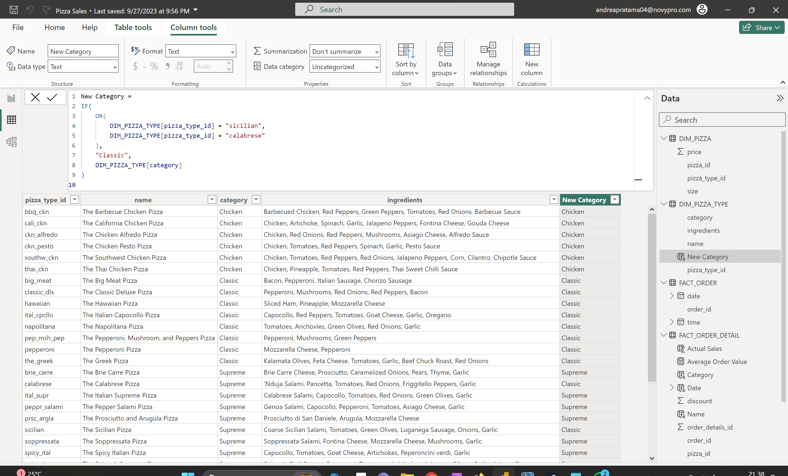

# Pizza Sales

## Introduction
This project aims to analyze and visualize XYZ Pizza's sales data for the year 2022. The goal is to create a dashboard and new insights that can be utilized by XYZ Pizza for planning the upcoming year.

## Problem Statement
XYZ Pizza requires comprehensive data analysis and visualization to understand sales trends, identify the most popular pizzas, and gain insights for strategic decision-making.

## Skills Demonstrated
- Data Analysis
- Data Visualization
- Data Cleaning
- Data Transformation
- Dashboard Creation

## Data Sourcing
Sales data for pizzas has been obtained from XYZ Pizza and is presented in four attached tables.

## Data Transformation
During the data preparation phase, cleaning and transformation steps were undertaken to ensure a dataset ready for analysis without missing data. Transformation steps include:
| Transformation Task                                                                  | Result                                                                                                      |
| ------------------------------------------------------------------------------------ | ----------------------------------------------------------------------------------------------------------- |
| Remove pizzas without prices,orders without timestamps,order details without quantities                 |                                                                |
| Adding category using Related function            |                                                                |
| Adding name using Related function        |                                                                |
| Adding price using Related function        |                                                                |
| Adding size using Related function          |                                                                |
| Transform pizza categories (Sicilian, Calabrese) | 

## Modeling
The modeling aspect of this project focuses more on data analysis and visualization.

The model is Snowflake Schema

## Analyze & Visualization
The resulting dashboard will be used by analysts and accessed daily through the PC/Desktop platform. Monitored metrics include Total Sales (Actual Sales), Total Orders, and Average Order Value. Specific data points requiring attention include pizzas without prices, orders without timestamps, and order details without quantities. Information such as the most popular pizza types/categories, sales trends, and other insights will be considered.

This report have 2 page :
- Analysis
- Detail

### You can interact with report here _[Novypro](https://www.novypro.com/project/pizza-sales-15)_

# Conclusion

In conclusion, the Pizza Sales Analysis & Visualization project has successfully addressed the goals set by XYZ Pizza to gain insights from their sales data for the year 2022. The process involved thorough data sourcing, cleaning, and transformation, leading to the creation of a meaningful dashboard. The analysis has provided valuable information about sales trends, popular pizza types, and other key metrics that can aid strategic decision-making.

The data transformation phase played a crucial role in ensuring the quality of the dataset for analysis. Removing pizzas without prices, orders without timestamps, and order details without quantities helped create a clean and reliable dataset. Additionally, transforming pizza categories Sicilian and Calabrese into the Classic category enhanced the consistency of the data.

The resulting dashboard, accessible daily on PC/Desktop platforms, monitors important metrics such as Total Sales (Actual Sales), Total Orders, and Average Order Value. This will empower analysts at XYZ Pizza to make informed decisions based on real-time data.
